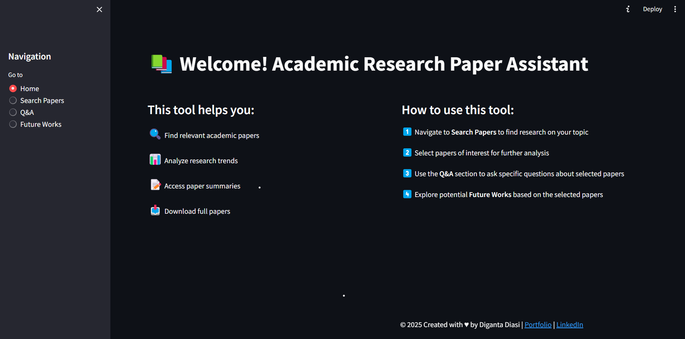
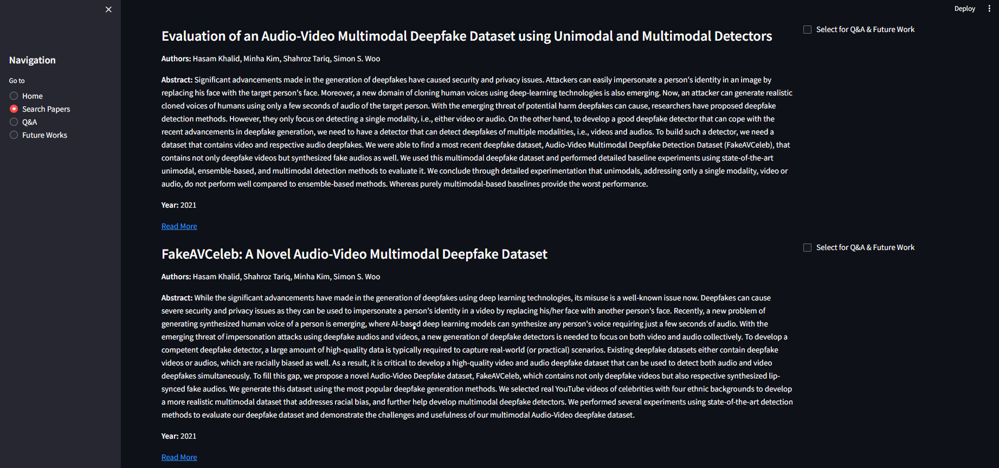
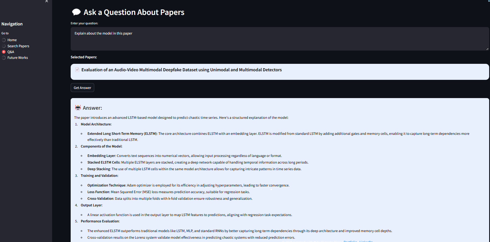
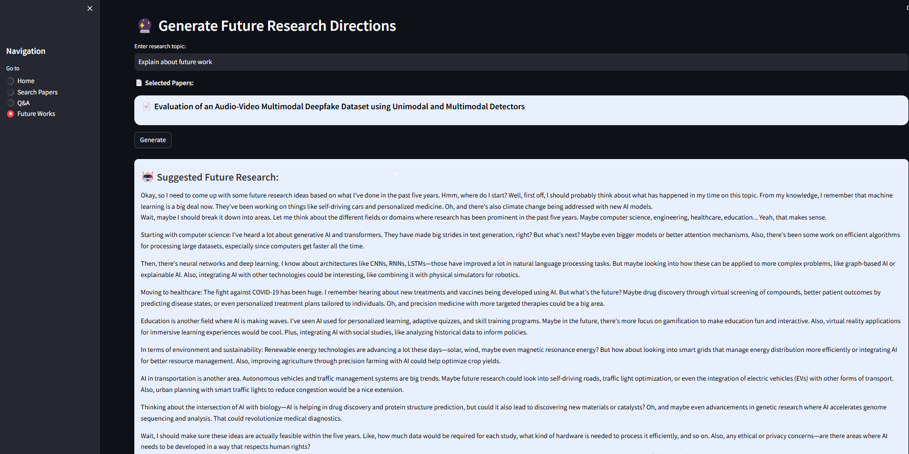

# Academic Research Paper Assistant


## 📌 Overview
The **Academic Research Paper Assistant** is a powerful AI-driven tool that helps users search, analyze, and generate insights from academic papers. The application integrates **FastAPI (Backend)** and **Streamlit (Frontend)**, along with **Neo4j (Graph Database)** and **LLMs** for processing research queries.

## 🚀 Features
- 🔍 **Search & Fetch Research Papers** from arXiv.
- 📊 **Analyze Research Trends** using Neo4j.
- 📝 **Summarize Research Papers** using LLM models.
- 💬 **Ask Questions** related to selected papers.
- 🔮 **Generate Future Research Directions**.

## Home Page


## Search Paper


## Q&A


## Future Work

---

## 🏗️ Tech Stack
- **Frontend**: [Streamlit](https://streamlit.io/)
- **Backend**: [FastAPI](https://fastapi.tiangolo.com/)
- **Database**: [Neo4j](https://neo4j.com/)
- **LLMs**: [Ollama](https://ollama.ai/) / [Transformers](https://huggingface.co/docs/transformers/index)
- **Deployment**: Render/Railway (Backend), Streamlit Cloud (Frontend)

## 📁 Project Structure
```
academic_research_assistant/
├── .env                 # Environment Variables
├── README.md            # Project Documentation
├── requirements.txt     # Dependencies
├── backend/             # FastAPI Backend
│   ├── main.py         # FastAPI Entry Point
│   ├── agents/         # AI Agents for Search, Q&A, Future Works
│   ├── database/       # Neo4j Database Client
│   └── utils/          # PDF Processing Utility
└── frontend/            # Streamlit Frontend
    ├── app.py          # Streamlit UI
```

## 🛠️ Installation & Setup
### **1️⃣ Clone the Repository**
```sh
git clone https://github.com/digantadiasi195/Academic_Research_Paper_Assistant
cd Academic_Research_Paper_Assistant
```

### **2️⃣ Install Dependencies**
```sh
pip install -r requirements.txt
```

### **3️⃣ Set Up Environment Variables**
Create a `.env` file in the root directory and add:
```sh
NEO4J_URI=neo4j+s://your-instance.databases.neo4j.io
NEO4J_USERNAME=neo4j
NEO4J_PASSWORD=your_password
LLM_MODEL=deepseek-r1:1.5b
```

### **4️⃣ Start the Backend (FastAPI)**
```sh
cd backend
uvicorn main:app --reload
```
API will be available at: `http://127.0.0.1:8000`

### **5️⃣ Start the Frontend (Streamlit)**
```sh
cd ../frontend
streamlit run app.py
```
Frontend UI will open in the browser.

## 🌎 Deployment
### **Deploy FastAPI on Render/Railway**
- **Render**: [Render.com](https://render.com/)
- **Railway**: [Railway.app](https://railway.app/)

**Start Command:**
```sh
uvicorn backend.main:app --host 0.0.0.0 --port 8000
```
strem
### **Deploy Streamlit on Streamlit Cloud**
- Go to [Streamlit Cloud](https://share.streamlit.io/)
- Connect GitHub repo & deploy.

## 📜 API Endpoints
| Method | Endpoint | Description |
|--------|---------|-------------|
| `GET` | `/health` | Check API Health |
| `POST` | `/search` | Search for research papers |
| `POST` | `/qa` | Ask a question about selected papers |
| `POST` | `/generate-future-works` | Generate future research directions |


## 👨‍💻 Author
**[SANTANU SAHOO]**  
🔗 [LinkedIn](https://www.linkedin.com/in/santanusahoo2003)  

## ⭐ Support & Contribution
If you find this useful, give it a ⭐ on GitHub! Contributions are welcome. 😊
